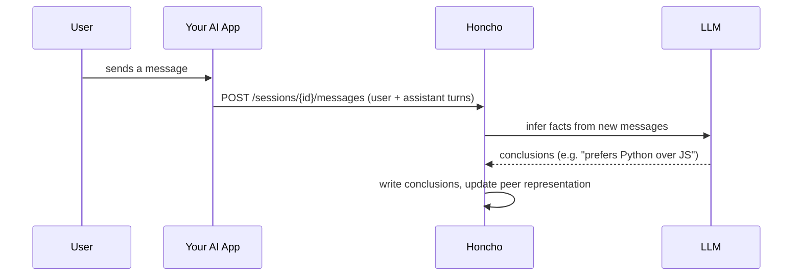
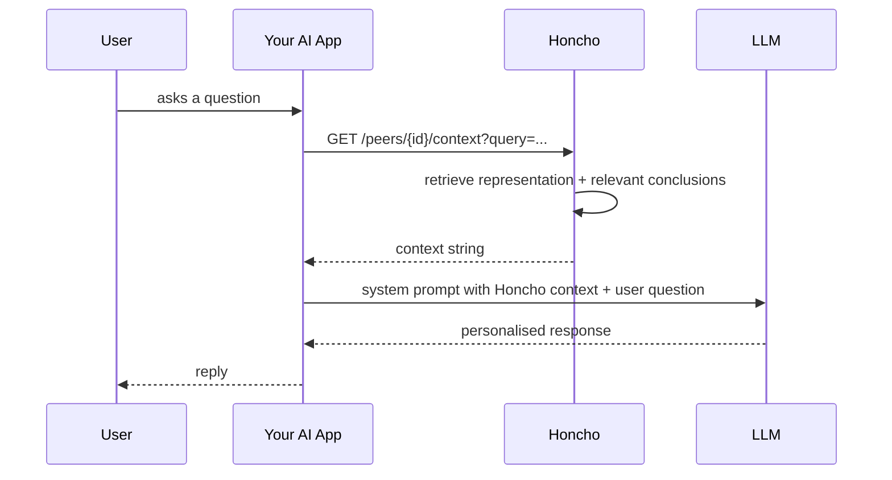
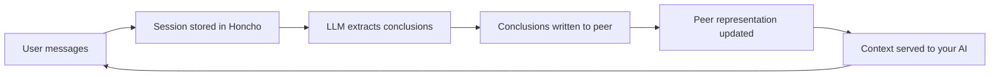

# Honcho Helpdesk

A dashboard for self-hosted [Honcho](https://github.com/plastic-labs/honcho) instances. Honcho is a user context and memory server for AI applications — the official cloud dashboard (honcho.dev) covers the basics, but this fills the gap for teams that self-host or need more depth: browse workspaces, peers, sessions, messages, and conclusions, query peer knowledge via chat, import markdown notes to hydrate the memory store, monitor activity analytics, and diagnose exactly what context your AI would receive.

> **New to Honcho?** Visit [`/learn`](http://localhost:3000/learn) after starting the app for a plain-English overview of how Honcho works and what each term in this dashboard means.

## Requirements

- Node.js 20+
- A running Honcho instance (self-hosted or remote)

## Setup

```bash
npm install
cp .env.example .env.local
```

Edit `.env.local`:

```env
HONCHO_BASE_URL=http://localhost:8000   # URL of your Honcho instance
HONCHO_API_KEY=                         # Optional — leave blank for unauthenticated instances
```

## Running

```bash
npm run dev
```

Open [http://localhost:3000](http://localhost:3000).

> **Note:** After a hot restart without clearing `.next`, Turbopack can serve 404s for deep routes. Use `npm run dev:clean` to clear the cache first:
>
> ```bash
> npm run dev:clean
> ```

## Pages

| Route | Description |
|---|---|
| `/` | All workspaces as clickable cards |
| `/learn` | Plain-English guide to Honcho concepts, with technical detail for engineers |
| `/workspaces` | Searchable, paginated workspace table |
| `/workspaces/[id]` | Tabs for Peers, Sessions, Conclusions, and Ask |
| `/workspaces/[id]/peers/[peerId]` | Peer representation, context, and sessions |
| `/workspaces/[id]/sessions/[sessionId]` | Full message thread |
| `/workspaces/[id]/import` | Hydrate workspace from markdown files |
| `/stats` | Activity charts for volume, freshness, coverage, and heatmap |
| `/diagnose` | Inspect what Honcho knows about a peer |

## Features

### Learn page

`/learn` explains Honcho to both non-technical developers and AI engineers. It covers the memory loop in three steps, defines every term used in the dashboard (workspace, peer, session, conclusion, representation, context), and links to the relevant pages. Plain-English descriptions sit alongside technical API notes so both audiences get what they need.

### Ask tab

Inside any workspace, the Ask tab lets you query Honcho's knowledge in two ways.

**Peer Chat** selects a peer and asks a question. The answer streams from Honcho's agentic search over that peer's representation.

**Workspace Search** runs semantic search across all messages in the workspace.

### Workspace Hydration (Import)

Upload markdown files such as daily notes, knowledge docs, or how-tos. The app uses Honcho's peer chat to extract structured conclusions and writes them directly into the workspace. Progress streams back in real time as conclusion cards.

### Stats

Four analytics views built from your live Honcho data.

**Volume** shows message and conclusion counts by day, per workspace. **Conclusion freshness** shows how recently conclusions were written, bucketed into fresh, recent, aging, and stale. **Coverage** shows which peers have conclusions across which workspaces. **Heatmap** shows peer message activity over time.

### Diagnose

Inspect exactly what context Honcho would return for a given observer and target pair. Useful for debugging memory retrieval before deploying to production.

## How Honcho works

### Writing a conversation to memory

Your AI app sends each exchange to Honcho as it happens. Honcho stores the raw messages and then processes them in the background to extract conclusions about the user and update their representation.



### Retrieving context before a response

Before your AI answers, it asks Honcho what it knows about this user. Honcho returns a representation built from past conversations so the response can be personalised without the AI seeing raw history.



### The memory accumulation loop

Over many sessions, Honcho builds an increasingly complete picture of each peer. New messages are processed against existing conclusions so the representation stays current rather than growing unboundedly.



## Regenerating types

Types are generated from the live Honcho OpenAPI spec:

```bash
npm run generate-types
```

Requires the server at `HONCHO_BASE_URL` to be reachable.

## Tests

```bash
npm test           # unit tests (Vitest)
npm run test:e2e   # browser smoke tests (Playwright, requires dev server)
```
