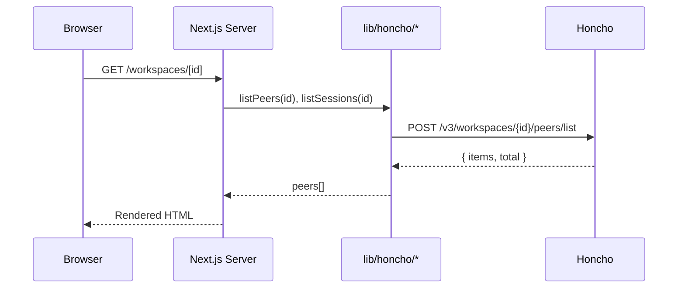
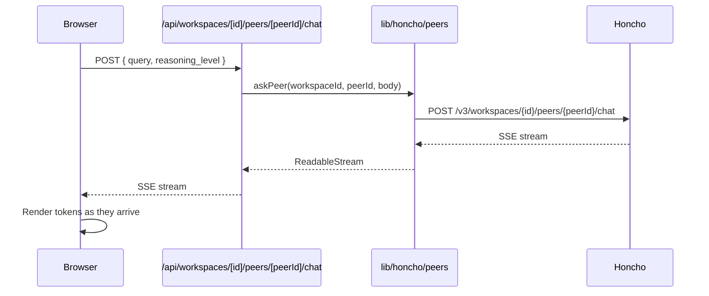
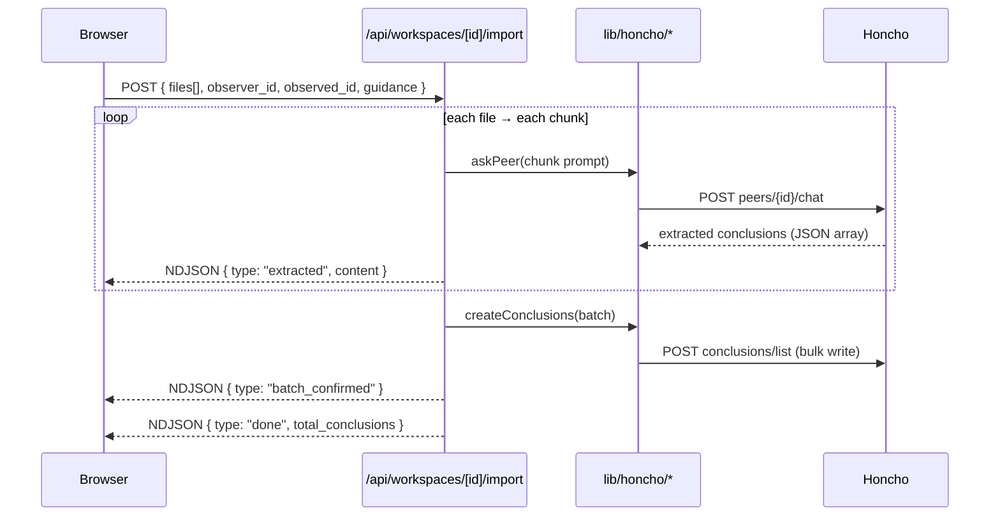

# Honcho Desktop

A dashboard for inspecting and managing a self-hosted [Honcho](https://github.com/plastic-labs/honcho) instance. Browse workspaces, peers, sessions, messages, and conclusions — query peer knowledge via chat, search, import markdown notes, and monitor activity analytics.

## Requirements

- Node.js 20+
- A running Honcho instance (self-hosted or remote)

## Setup

```bash
npm install
cp .env.example .env.local
```

Edit `.env.local`:

```env
HONCHO_BASE_URL=http://localhost:8000   # URL of your Honcho instance
HONCHO_API_KEY=                         # Optional — leave blank for unauthenticated instances
```

## Running

```bash
npm run dev
```

Open [http://localhost:3000](http://localhost:3000).

> **Note:** After a hot restart without clearing `.next`, Turbopack can serve 404s for deep routes. Use `npm run dev:clean` to clear the cache first:
>
> ```bash
> npm run dev:clean
> ```

## Pages

| Route | Description |
|---|---|
| `/` | All workspaces as clickable cards |
| `/workspaces` | Searchable, paginated workspace table |
| `/workspaces/[id]` | Tabs: Peers · Sessions · Conclusions · Ask |
| `/workspaces/[id]/peers/[peerId]` | Peer representation, context, and sessions |
| `/workspaces/[id]/sessions/[sessionId]` | Full message thread |
| `/workspaces/[id]/import` | Hydrate workspace from markdown files |
| `/stats` | Activity charts (volume, freshness, coverage, heatmap) |
| `/diagnose` | Inspect what Honcho knows about a peer |

## Features

### Ask tab

Inside any workspace, the **Ask** tab lets you query Honcho's knowledge:

- **Peer Chat** — select a peer and ask a question; the answer streams from Honcho's agentic search over that peer's representation
- **Workspace Search** — semantic search across all messages in the workspace

### Workspace Hydration (Import)

Upload markdown files (daily notes, knowledge docs, how-tos). The app uses Honcho's peer chat to extract structured conclusions and writes them directly into the workspace. Progress streams back in real time as conclusion cards.

### Stats

Four analytics views built from your live Honcho data:

- **Volume** — message and conclusion counts by day, per workspace
- **Freshness** — how recently conclusions were written (fresh / recent / aging / stale)
- **Coverage** — which peers have conclusions across which workspaces
- **Heatmap** — peer message activity over time

### Diagnose

Inspect exactly what context Honcho would return for a given observer/target pair — useful for debugging memory retrieval before deploying to production.

## Architecture

Three-tier — each layer has one job:

```
Presentation   app/page.tsx, app/workspaces/**/page.tsx
               Server components call the data layer directly.
               Client components (WorkspaceTabs, AskPanel, ImportPanel) call API routes.

Business       app/api/workspaces/**/route.ts, app/api/stats/**/route.ts
               Route handlers — proxy and orchestrate data layer calls.
               Consumed by client-side components only.

Data           lib/honcho/
               Typed HTTP client + one module per resource.
               Only layer that reads env vars or knows the Honcho URL.
```

## Sequence Diagrams

### Page load (server component)



### Peer Chat (streaming)



### Workspace Hydration (import)



## Regenerating types

Types are generated from the live Honcho OpenAPI spec:

```bash
npm run generate-types
```

Requires the server at `HONCHO_BASE_URL` to be reachable.

## Tests

```bash
npm test           # unit tests (Vitest)
npm run test:e2e   # browser smoke tests (Playwright, requires dev server)
```
